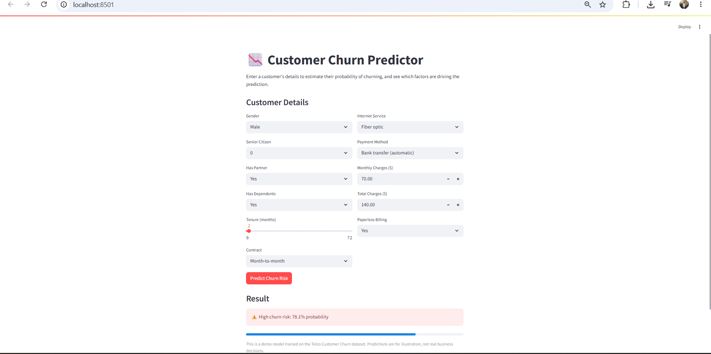
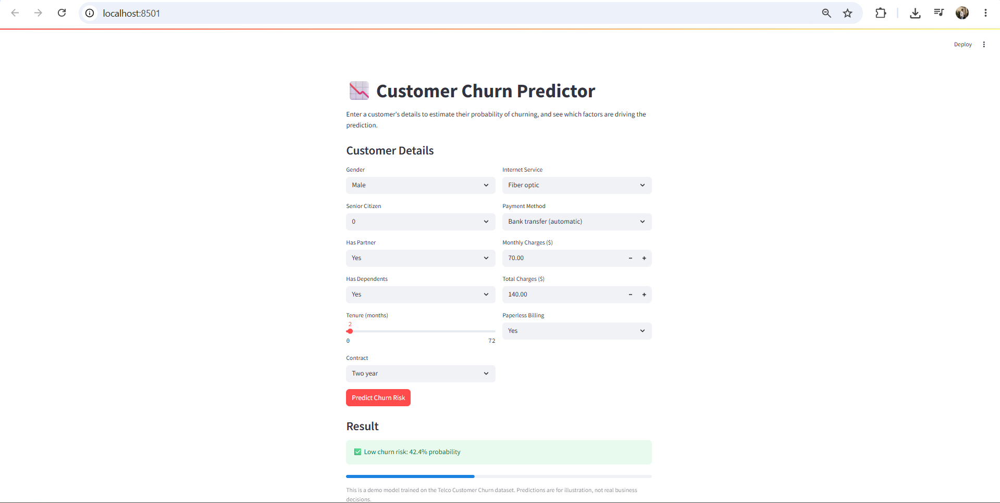

# Customer Churn Prediction — End to End Project

A complete data science project: from raw data to a deployed, interactive prediction app.
Built to predict which customers are likely to cancel their subscription, so a
retention team could act before they leave.

## Demo

**Streamlit app in action:**



*Example: a new customer (2 months tenure) on a month-to-month contract with fiber
optic internet is flagged as high risk.*



*Same customer, switched to a two-year contract — predicted churn risk drops
sharply, showing contract type is the dominant driver in this model.*

> To add your own: create a `screenshots/` folder in this repo, upload your two
> PNGs there, and rename them to `app_screenshot_1.png` and `app_screenshot_2.png`
> (or update the filenames above to match whatever you name them).

## Problem Statement
A subscription-based telecom company wants to identify customers likely to cancel
their service (churn) so the retention team can intervene before they leave.

## Project Structure
```
churn-prediction/
├── data/                        # Place telco_churn.csv here (not included — see Setup)
├── src/
│   └── churn_pipeline.py        # Full pipeline: EDA -> cleaning -> modeling -> evaluation -> SHAP
├── models/                      # Saved model artifacts (generated by pipeline)
├── outputs/                     # EDA plots, confusion matrices, SHAP plots (generated)
├── screenshots/                 # App screenshots for this README
├── app.py                       # Streamlit app for interactive predictions
├── churn_prediction.ipynb       # Google Colab version — run the whole pipeline with zero local setup
├── requirements.txt
└── README.md
```

## Setup

### Option A — Run locally
1. Create a virtual environment and install dependencies:
   ```bash
   python -m venv venv
   source venv/bin/activate   # Windows: venv\Scripts\activate
   pip install -r requirements.txt
   ```

2. Download the dataset from Kaggle:
   [Telco Customer Churn Dataset](https://www.kaggle.com/blastchar/telco-customer-churn)

   Place the CSV at `data/telco_churn.csv`.

3. Run the pipeline (EDA, cleaning, modeling, evaluation, SHAP, saves model):
   ```bash
   python src/churn_pipeline.py
   ```
   This generates:
   - EDA plots and confusion matrices in `outputs/`
   - A SHAP summary plot in `outputs/shap_summary.png`
   - Trained model artifacts in `models/`

4. Launch the interactive app:
   ```bash
   streamlit run app.py
   ```

### Option B — Run in Google Colab (no local setup required)
Open `churn_prediction.ipynb` in [Google Colab](https://colab.research.google.com),
click **Runtime → Run all**, and upload `telco_churn.csv` when prompted. The
notebook runs the entire pipeline — EDA, feature engineering, model training,
evaluation, and SHAP explainability — inline, plus a live prediction demo cell
at the end. Model files can be downloaded from the last cell if you want to run
the Streamlit app locally afterward.

## Approach

1. **Data Cleaning** — handled missing `TotalCharges` values, dropped non-predictive ID column.
2. **EDA** — churn distribution, churn by contract type, tenure vs churn, correlation heatmap.
3. **Feature Engineering** — tenure buckets, average monthly spend.
4. **Class Imbalance** — addressed with SMOTE oversampling on the training set only.
5. **Modeling** — compared Logistic Regression (baseline), Random Forest, and XGBoost.
6. **Evaluation** — precision, recall, F1, ROC-AUC (not just accuracy, since classes are imbalanced).
7. **Explainability** — SHAP values to explain which features drive each prediction.
8. **Deployment** — Streamlit app for interactive, real-time predictions.

## Key Business Insight

Contract type is the single strongest driver of churn risk in this model. Testing
the app directly confirms it: holding tenure, internet type, and billing details
constant, moving a customer from a **month-to-month** to a **two-year contract**
reduced predicted churn probability by roughly **35 percentage points** (78% → 42%
in one test case) — even for an otherwise high-risk, newly-signed customer.

This suggests the retention team's highest-leverage action isn't discounting
monthly bills, but incentivizing customers to upgrade to longer contracts —
e.g. through loyalty pricing or bundled perks for annual commitments.

Fiber optic customers and month-to-month, short-tenure customers consistently
show up as the highest-risk segment across the EDA and SHAP analysis.

## A Note on Model Limitations
While testing the app, I found that entering internally inconsistent values (e.g.
`Total Charges` far exceeding what `Monthly Charges × Tenure` would imply) can
distort predictions, since the model relies on an engineered `avg_monthly_spend`
feature. This is a good reminder that a model's output is only as reliable as the
consistency of its inputs — in a production version, this would be fixed by
auto-deriving `Total Charges` from tenure and monthly charges rather than
accepting it as a free-form field.

## Next Steps / Extensions
- Auto-calculate `Total Charges` from tenure × monthly charges to prevent inconsistent inputs
- Show per-prediction SHAP explanations directly in the Streamlit app, not just in the notebook
- Hyperparameter tuning with GridSearchCV or Optuna
- Deploy the Streamlit app to Streamlit Community Cloud for a live public demo
- Add a batch-prediction mode (upload a CSV of customers, get predictions for all)
- Track experiments with MLflow

## Tech Stack
Python · pandas · scikit-learn · XGBoost · imbalanced-learn · SHAP · Streamlit · matplotlib/seaborn · Google Colab
